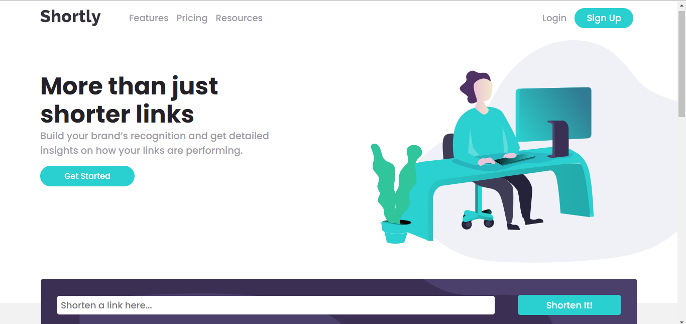

# Frontend Mentor - Shortly URL shortening API Challenge solution

This is a solution to the [Shortly URL shortening API Challenge challenge on Frontend Mentor](https://www.frontendmentor.io/challenges/url-shortening-api-landing-page-2ce3ob-G). Frontend Mentor challenges help you improve your coding skills by building realistic projects.

## The challenge

Users should be able to:

- View the optimal layout for the site depending on their device's screen size
- Shorten any valid URL
- See a list of their shortened links, even after refreshing the browser
- Copy the shortened link to their clipboard in a single click
- Receive an error message when the `form` is submitted if:
  - The `input` field is empty

## Screenshot

## Links

- Solution URL: [GitHub repo](https://github.com/JustShuaib/url-shortening-api)
- Live Site URL: [Live site](https://url-shortening-api-shuaib.netlify.app/)

## Built with

- HTML
- CSS
- JavaScript

## Useful resources

- [dev-tips-and-tricks](https://www.dev-tips-and-tricks.com/animate-elements-scrolled-view-vanilla-js) - When I was done with the project, I wanted to spice things up so I added animation while scrolling through the page. This article came in handy.
- [w3 docs](https://www.w3docs.com/snippets/javascript/how-to-copy-the-text-to-the-clipboard-with-javascript.html) - This post gave more insight about working with the clipboard.

## Author

- Github - [Adeoti Shuaib](https://www.github.com/JustShuaib)
- Frontend Mentor - [@justshuaib](https://www.frontendmentor.io/profile/justshuaib)
- Twitter - [@JustShuaib](https://www.twitter.com/JustShuaib)
